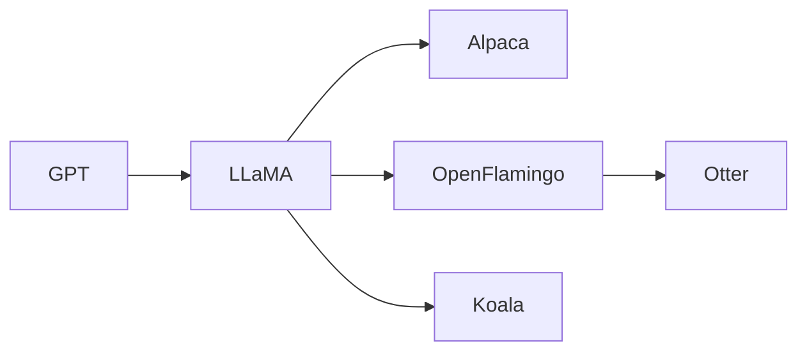

# LLM
<p><span data-tag-name="blockquote" class="el-blockquote"><blockquote>
<p>Large Language Model</p>
</blockquote></span></p>

> [!CITE] ...around half of the improvement in language models over the past four years comes from *training them on more data*
> <cite>[@villalobosWillWeRun2022a](@villalobosWillWeRun2022a.md#) (2022)</cite>

> [!FACT]
> [230620](230620.md#) [NGA](NGA.md#) (Mark Munsell) visited [Meta](Meta.md#), [Google](Google.md#), [OpenAI](OpenAI.md#), [Microsoft](Microsoft.md#), and Anthropic and said they all said “*bigger is better*”, also mixing text and image is the next phase for improvement

> [!NOTE] 
> 
> https://github.com/ray-project/llm-numbers


## (Current) Issues with LLMs
-  Efficiency
-  Updateability
-  Provenance

> [!CITE] ...the stock of high-quality language data will exhausted...likely before **2026**
> <cite>[@villalobosWillWeRun2022a](@villalobosWillWeRun2022a.md#)</cite>

> [!TIP] 
> [Holistic Evaluation of Language Models (HELM)](https://crfm.stanford.edu/helm/latest/?) is a living benchmark that aims to improve the transparency of language models
> [@liangHolisticEvaluationLanguage](@liangHolisticEvaluationLanguage.md#)

### LLM [Adversarial Examples](Adversarial%20Machine%20Learning.md#)
-  [Universal and Transferable Adversarial Attacks on Aligned Language Models](@zouUniversalTransferableAdversarial2023.md#)

## (Current) Challenges
-  Data Ingestion
-  Data Indexing

## 8 Things to Know about LLMs
> [@bowmanEightThingsKnow2023](@bowmanEightThingsKnow2023.md#)

1.  LLMs predictably get more capable with increasing investment, even without targeted innovation.  
2.  Many important LLM behaviors emerge unpredictably as a byproduct of increasing investment.  
3.  LLMs often appear to learn and use representations of the outside world.  
4.  **There are no reliable techniques for steering the behavior of LLMs**.  
5.  **Experts are not yet able to interpret the inner workings of LLMs**.  
6.  Human performance on a task isn't an upper bound on LLM performance.  
7.  LLMs need not express the values of their creators nor the values encoded in web text.  
8.  Brief interactions with LLMs are often misleading.

## LLMs
```img-gallery
path: 3 Resources/__attachments/media/llm
type: horizontal
```


> Source: [@puchertLLMMapsVisualMetaphor2023](@puchertLLMMapsVisualMetaphor2023.md#)

> [!TIP] 
> See [LLM collection](https://www.promptingguide.ai/models/collection) for more complete list

| Model            | Details |
| ---------------- | ------- |
| [LLaMA](LLaMA.md#)        |         |
| [BLOOM](BLOOM.md#)        |         |
| [OpenFlamingo](OpenFlamingo.md#) |         |
| [Koala](Koala.md#)        |         |
| [GPT](GPT.md#)          |         |
| [Otter](Otter.md#)        |         |
| [Alpaca](Alpaca.md#)       |         |
| [Dolly](Dolly.md#)                 |         |




## Tools and Libraries
### Ollama
[GitHub](https://github.com/jmorganca/ollama)
<p><span data-is-embed="true" data-embed-type="image" class="el-embed-image el-p" data-tag-name="p"><p>  </p></span></p>
> [!SUMMARY]
> Get up and running with large language models locally
> [230722](230722.md#) In early access preview #only on #OS/Mac, but looks really promising 😎


### lit-gpt
[GitHub](https://github.com/Lightning-AI/lit-gpt)
<p><span data-is-embed="true" data-embed-type="image" class="el-embed-image el-p" data-tag-name="p"><p>  </p></span></p>
> [!SUMMARY]
> Hackable implementation of #SOTA #OSS **LLM**s based on nano[GPT](GPT.md#). Supports flash attention, 4-bit and 8-bit quantization, LoRA and [LLaMA](LLaMA.md#)-Adapter [fine-tuning](fine-tuning.md#), pre-training. [Apache](Apache.md#) 2.0-licensed. 

### CodeTF
[GitHub](https://github.com/salesforce/CodeTF)
<p><span data-is-embed="true" data-embed-type="image" class="el-embed-image el-p" data-tag-name="p"><p>  </p></span></p>
> [!SUMMARY]
> One-stop [Python](Python%20Ecosystem.md#) [transformer](transformer.md#)-based #library for **code** large language models (**Code** LLMs) and code intelligence, provides a seamless interface for training and inferencing on code intelligence tasks like code summarization, translation, code generation and so on. It aims to facilitate easy integration of #SOTA Code LLMs into real-world applications.

Install with [pip](pip.md#):
```python
pip install salesforce-codetf==1.0.1.1
```
Example #usage:
```python
from codetf.models import model_zoo
print(model_zoo)
```

> [!TIP] 
> Provides good listing of models and might be useful for the [Formal Verification of Deep Neural Networks](Formal%20Verification%20of%20Deep%20Neural%20Networks.md#)

### OpenLLM
[GitHub](https://github.com/bentoml/OpenLLM)
<p><span data-is-embed="true" data-embed-type="image" class="el-embed-image el-p" data-tag-name="p"><p>  </p></span></p>
> [!SUMMARY]
> Open platform for operating large language models (**LLM**s) in production. [Fine-tune](Fine-Tuning.md#), serve, deploy, and monitor any **LLM**s with ease. Built by the people that made [BentoML](BentoML.md#)

### ChainFury
[GitHub](https://github.com/NimbleBoxAI/ChainFury)
<p><span data-is-embed="true" data-embed-type="image" class="el-embed-image el-p" data-tag-name="p"><p>  </p></span></p>
> [!SUMMARY]
> Tool that simplifies the creation and management of chains of prompts, making it easier to build complex chat applications using LLMs - uses [LangChain](LangChain.md#) with an interface built with [react-flow](react-flow.md#) (inspired by [LangFlow](LangFlow.md#))

-  [230429](230429.md#) I built a math-capable chat bot in seconds!!! 🆒 [link](https://chainfury.nbox.ai/)

### EasyLM
[GitHub](https://github.com/young-geng/EasyLM)
<p><span data-is-embed="true" data-embed-type="image" class="el-embed-image el-p" data-tag-name="p"><p>  </p></span></p>
> [!SUMMARY]
> One stop solution for pre-training, finetuning, evaluating and serving LLMs in [JAX](JAX.md#)/Flax - supports [LLaMA](LLaMA.md#), [GPT](GPT.md#)-J, [OPT](@zhangOPTOpenPretrained2022.md#), and Ro[BERT](BERT.md#)a

### FastChat
[GitHub](https://github.com/lm-sys/FastChat)
<p><span data-is-embed="true" data-embed-type="image" class="el-embed-image el-p" data-tag-name="p"><p>  </p></span></p>
> [!SUMMARY]
> An open platform for training, serving, and evaluating large language model based chatbots - platform used to create "**Vicuna**: An Open Chatbot Impressing [GPT](GPT.md#)-4"

### LMFlow
[GitHub](https://github.com/OptimalScale/LMFlow)
<p><span data-is-embed="true" data-embed-type="image" class="el-embed-image el-p" data-tag-name="p"><p>  </p></span></p>
> [!SUMMARY]
> An Extensible Toolkit for Finetuning and Inference of Large Foundation Models. **Large Language Model for All**.

### openplayground
[GitHub](https://github.com/nat/openplayground)
<p><span data-is-embed="true" data-embed-type="image" class="el-embed-image el-p" data-tag-name="p"><p>  </p></span></p>
> [!SUMMARY]
> An LLM playground you can run on your laptop


### rustformers/llm
[GitHub](https://github.com/rustformers/llm)
<p><span data-is-embed="true" data-embed-type="image" class="el-embed-image el-p" data-tag-name="p"><p>  </p></span></p>
> [!SUMMARY]
> Run inference for Large Language Models on CPU, with [Rust](Rust%20Ecosystem.md#)

> [!TIP] 
> [230511](230511.md#) Supports [GPT](GPT.md#)-2/J/NeoX, [LLaMA](LLaMA.md#), [BLOOM](BLOOM.md#)

### Web LLM
[GitHub](https://github.com/mlc-ai/web-llm)
<p><span data-is-embed="true" data-embed-type="image" class="el-embed-image el-p" data-tag-name="p"><p>  </p></span></p>
> [!SUMMARY]
> **Brings language model chats directly onto web browsers**. Everything runs inside the #web/browser with no server support and accelerated with [WebGPU](WebGPU.md#).


#### MLC
> [Machine Learning](Machine%20Learning.md#) Compiliation

[GitHub](https://github.com/mlc-ai/mlc-llm)
<p><span data-is-embed="true" data-embed-type="image" class="el-embed-image el-p" data-tag-name="p"><p>  </p></span></p>
> [!SUMMARY]
> Enable everyone to develop, optimize and deploy AI models natively on everyone's devices


## Resources
-  Improve Chat[GPT](GPT.md#) with [Knowledge Graphs](Knowledge%20Graphs.md#) ([blog](https://mlabonne.github.io/blog/posts/Article_Improve_ChatGPT_with_Knowledge_Graphs.html))
-  [LLMs licensed for commercial use](https://github.com/eugeneyan/open-llms)
-  [Some remarks on Large Language Models](https://gist.github.com/yoavg/59d174608e92e845c8994ac2e234c8a9)
-  [LLM Collection](https://www.promptingguide.ai/models/collection)
-  [LLM Learning Lab](https://lightning.ai/pages/llm-learning-lab/)

### Examples
#### create-t3-turbo-ai
[GitHub](https://github.com/zckly/create-t3-turbo-ai)
<p><span data-is-embed="true" data-embed-type="image" class="el-embed-image el-p" data-tag-name="p"><p> </p></span></p>
> [!SUMMARY]
> Build full-stack, [type-safe](I%20Do%20Not%20Like%20TypeScript.md#), LLM-powered apps with the **T3 Stack** - Turborepo, OpenAI, and [LangChain](LangChain.md#)
